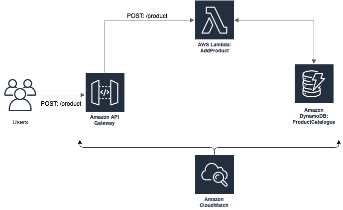
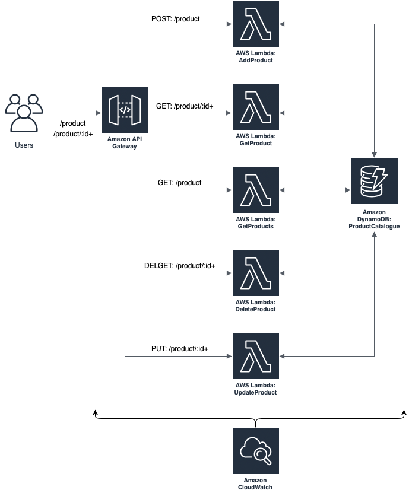
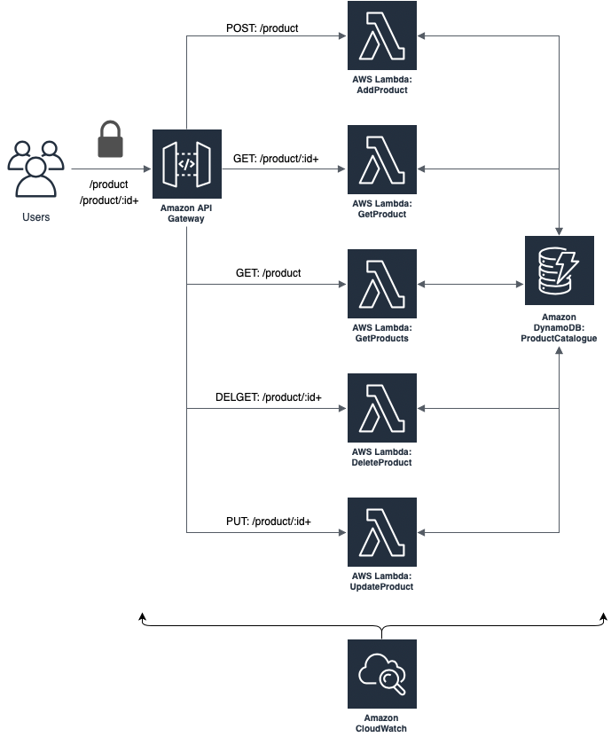

# Create RESTful API based on AWS services

## EXERCISE 1.1

### Goal
//Dodać opis do ćwiczenia co chcemy osiągnąć w tej części



### Instruction

1. Create *DynamoDB* table - **ProductCatalog** with primary key `id`
2. Prepare bussines logic for creating new product:
    1. Create **AddProduct** *Lambda* with `Python 3.8` and create new policy for communication with *DynamoDB*
    2. Prepare Python code for lambda in order to add record into `ProductCatalog` table.
    3. Add permission to *DynamoDB* for action - `Write : PutItem` in service role assigned to AddProduct *Lambda*
    4. Test **AddProduct** *Lambda* with JSON:
        ```
        {
            "name": "Funky Bear",
            "desc": „Money box Funky Bear 16x30 cm blue. Style: modern, vanguard. Material: dolomite”
        }
        ```
    5. Verify function execution logs in *CloudWatch* to be sure that it works correctly
    6. Check item structure in **ProductCatalog** table
3. Create API datapoint for *Lambda* function:
    1. Create new Rest API for **ProductCatalog** in *APIGateway*
    2. Create API Resource for **Product**
    3. Create API Method **POST** in **Product** resource and integrate with Lambda function - **AddProduct**
    4. Deploy API to new **dev** stage
    5. Export data to Postman JSON
    5. Trigger datapoint from Postman without any authorization headers

### RESULT: 
Public create product REST API method in AWS environment based on services and serverless architecture, published for all consumers on development environment

### AWS Services: 
*DynamoDB*, *ApiGateway*, *Lambda*, *CloudWatch*


## EXERCISE 1.2

### Goal
//Dodać opis do ćwiczenia co chcemy osiągnąć w tej części



### Instruction

1. Prepare **GET** API method to get product data:
    1. Create **GetProduct** *Lambda* function and implement logic for retrive item from **ProductCatalog** *DynamoDB* table
    2. Create API Method **GET** with id as a parameter in **Product** resource and integrate with *Lambda* function - **GetProduct**
    3. Add permission to *DynamoDB* for action - `Read : GetItem` in service role assigned to **GetProduct** *Lambda*
    4. Test **GetProduct** *Lambda* with test tool in *ApiGateway*
2. Prepare **GET** API method to get all products list:
    1. Create **GetProducts** *Lambda* function and implement logic for retrive all items from **ProductCatalog** *DynamoDB* table
    2. Create API Method **GET** in **Product** resource and integrate with *Lambda* function - **GetProducts**
    3. Add permission to *DynamoDB* for action - `Read : Scan` in service role assigned to **GetProducts** *Lambda*
    4. Test **GetProducts** *Lambda* with test tool in *ApiGateway*
3. Prepare **DELETE** API method to remove product:
    1. Create **DeleteProduct** *Lambda* function and implement logic for delete product
    8. Create API Method **DELETE** with id as a parameter in **Product** resource and integrate with *Lambda* function - **DeleteProduct**
    9. Add permission to *DynamoDB* for action - `Write : DeleteItem` in service role assigned to **DeleteProduct** *Lambda*
    4. Test **DeleteProduct** *Lambda* with test tool in *ApiGateway*
4. Prepare **PUT** API method to update product:
    1. Create **UpdateProduct** *Lambda* function and implement logic for update existing product with payload:
        ```
        {
            "pathParameters": {
                "id": $your_item_id
            },
            "body": "{\"name\": \"Blue Funky Bear\",\"desc\": \"Blue Funky Bear, Material: dolomit\"}"
        }
        ```
    2. Create API Method **PUT** with id as a parameter in **Product** resource and integrate with *Lambda* function - **UpdateProduct**
    3. Add permission to *DynamoDB* for action - `Write : PutItem` and `Read : GetItem` in service role assigned to **UpdateProduct** *Lambda*
    4. Test **DeleteProduct** *Lambda* with test tool in *ApiGateway*
5. Deploy API to **dev** stage
6. Export **dev** stage as a JSON to Postman

### Result
All Rest API methods implemented for product resource and available for unauthorized users in AWS environment

### AWS Services
*DynamoDB*, *ApiGateway*, *Lambda*, *CloudWatch*

## EXERCISE 1.3

### Goal
//Dodać opis do ćwiczenia co chcemy osiągnąć w tej części



### Instruction

1. Create API Keys - `development-key` for API **Product** resource
2. Set `API Key Required` on `True` in each API method in **Product** resource
3. Deploy API to **dev** stage
4. Create **Usage Plan** - `Basic` without throttling and quota, add set **ProductCatalog** as API and **dev** stage
5. Add API Key - `development-key` to **Usage Plan**
6. Export **dev** stage as a JSON to Postman
7. Copy API Key - `development-key` and add to `x-api-key` header for each method in Postman 
8. Try execute API methods with `x-api-key` field in header

### Result
API is enable only for requests with specific api key in headers, in the other case response has HTTP Status code = 403 Forbidden

### AWS Services
*ApiGateway*