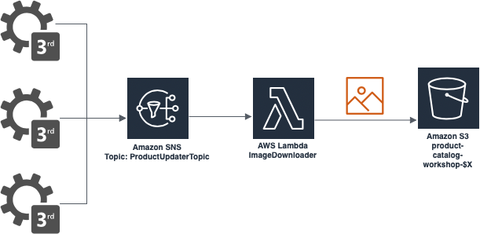
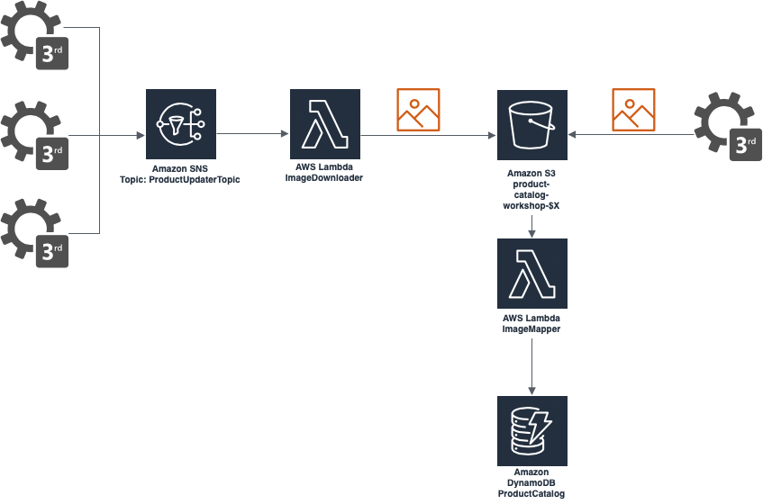

# Create solution for 3rd part systems to modify products state

## Goal

## 2.1. - Prepare infrastructure based on AWS Services and develop downloading image to S3 bucket

#### Architecture overview 



#### Instruction

1. Create *S3* instance with the name **product-catalog-workshop-$X** with disabled `Block all public access` option - grant public access to all resources.
2. Create *Amazon SQS* instance as `Standard Queue` - **products_updater_queue**
3. Create `Topic` in *Amazon SNS* resource - **ProductUpdaterTopic**
4. Create `Subscription` in *Amazon SNS* for *Amazon SQS* **products_updater_queue** with topic name **ProductUpdaterTopic** with filter: 
    ```
    { "type": ["img_update"] }
    ```
5. Create *Lambda* function **ImageDownloader** in `Python 3.8 `
6. In *Lambda* view add trigger and point it to *SNS* resource with `Arn` to topic with name **ProductUpdaterTopic**
7. Implement **ImageDownloader** business logic to download file into *S3* bucket with name passed in body parameter `id`
8. Add permission to *S3* for action - `Write : PutObject` in service role assigned to **ImageDownloader** *Lambda*
9. Test *Lambda* with *SNS* event data example:
    ```
    {
    "Records": [
        {
        "EventSource": "aws:sns",
        "EventVersion": "1.0",
        "EventSubscriptionArn": "arn:aws:sns:eu-central-1:192679695320:ProductUpdaterTopic:359db617-3695-4516-89f0-e630f5021641",
        "Sns": {
            "Type": "Notification",
            "MessageId": "918b6f81-26c1-521b-8abe-390876a95332",
            "TopicArn": "arn:aws:sns:eu-central-1:192679695320:ProductUpdaterTopic",
            "Subject": "None",
            "Message": "{\n    \"id\": \"17018938-1d9a-11ea-b480-f1ae0009ba19\",\n    \"url\": \"https://www.sfmeble.pl/product_picture/fit_in_1200x900/skarbonka-funky-bear16x30-cm-zolta.jpg\",\n    \"type\": \"img_update\"\n}",
            "Timestamp": "2020-01-03T14:22:32.368Z",
            "SignatureVersion": "1",
            "Signature": "b7RJGm7d4p1ayOyQ1AJNDBqELYtyutEPGsN5pYdY3Ppg2veYz0IJhQ/Taizu0GsADSyKfa24JGAr4R/Z2HCCFlb0FrQXlXlFKMgHw9KXKBfZuhPIXFmW7CRH9covzvx2cD2hbrTwGgBgR8uRAqLtBAGRcPwytaGqFFB0bHXJEK+LKlD5aqkG6kRrLiCu/aDc2E5Q7GhQ5uwbugWXpN+ubWUhPAb4INQgC/GHV/5Tt70aNXDta5LizpcMWctq74wcHk7U5WW4+69oZK7+gL/Dl1XMdRL+Z7DLgTp0sbkAnttZXLIp2cQmrEex8Q3SBmfsV8Emsc7UKaFlI9okZ+ND9A==",
            "SigningCertUrl": "https://sns.eu-central-1.amazonaws.com/SimpleNotificationService-6aad65c2f9911b05cd53efda11f913f9.pem",
            "UnsubscribeUrl": "https://sns.eu-central-1.amazonaws.com/?Action=Unsubscribe&SubscriptionArn=arn:aws:sns:eu-central-1:192679695320:ProductUpdaterTopic:359db617-3695-4516-89f0-e630f5021641",
            "MessageAttributes": {}
        }
        }
    ]
    }
    ```

10. Publish message in *SQS* **products_updater_queue** with body:

    ```
    {
    "id": "$product_id_from_your_db",
    "type": "img_update",
    "url": "https://www.sfmeble.pl/product_picture/fit_in_1200x900/skarbonka-funky-bear16x30-cm-zolta.jpg"
    }
    ```
    
11. Check *S3* bucket **product-catalog-workshop-$X** and find downloaded file

#### RESULT: 
Queue with subscriber on specific topic which trigger Lambda function for download image from external server into S3 bucket

#### AWS Services: 
*Lambda*, *SQS*, *SNS*, *S3*


## 2.2 Implementation for update product information in DynamoDB

#### Architecture overview 



#### Instruction

1. Create *Lambda* function **ImageIndexer** in `Python 3.8` 
2. Create new `notification` in *S3* **product-catalog-workshop-$X**, add event **ImageIndexEvent** and notification for event type - `All object create events` with prefix `product-catalog/`, suffix `.jpg` and send to **ImageIndexer** *Lambda*
3. Add permission to *DynamoDB* (**ProductCatalog**) for action - `Write : UpdateItem` in service role assigned to **ImageIndexer** `Lambda`
4. Add permission to *S3* (**product-catalog-workshop-$X**) for action - `Read : GetBucketLocation`  in service role assigned to **ImageIndexer** *Lambda*
5. Implement logic for **ImageIndexer** *Lambda* and test it with:

    ```
    {
    "Records": [
        {
        "eventVersion": "2.1",
        "eventSource": "aws:s3",
        "awsRegion": "eu-central-1",
        "eventTime": "2020-01-05T20:19:46.943Z",
        "eventName": "ObjectCreated:Put",
        "userIdentity": {
            "principalId": "A3CNVIGV1P5DNQ"
        },
        "requestParameters": {
            "sourceIPAddress": "31.182.148.135"
        },
        "responseElements": {
            "x-amz-request-id": "DD3425885FAE5EB7",
            "x-amz-id-2": "p6ySutHqN5AkaMYRevXEjJKuzTQP4NY/Ivd3T/xua+iLf7EDRb7BPRhhT0Vf0Ys6P2KZ5Kj5N3s="
        },
        "s3": {
            "s3SchemaVersion": "1.0",
            "configurationId": "ImageIndexEvent",
            "bucket": {
            "name": "product-catalog-aws-workshop-1",
            "ownerIdentity": {
                "principalId": "A3CNVIGV1P5DNQ"
            },
            "arn": "arn:aws:s3:::product-catalog-aws-workshop-1"
            },
            "object": {
            "key": "product-catalog/af027965-2b2a-11ea-af19-5f01a7b606b6.jpg",
            "size": 30981,
            "eTag": "9d96e4f0cda8c25065f843b119c29e1d",
            "sequencer": "005E1244E2E02E5668"
            }
        }
        }
    ]
    }
    ```
6. Test solution with complete workflow scenario - add jpg file with name as id of existed product in *DynamoDB* and check record structure in tabel **ProductCatalog**
7. Copy public image link and try download file in browser
8. Enable public access to *S3* for read all objects

#### RESULT: 
S3 trigger Lambda function for indexing every time on new jpg file creation. Images have public access and are available from S3.

#### AWS Services: 
*Lambda*, *DynamoDB*, *S3*

### Questions
1. What do you think is better option: public SQS or API endpoint which publish data to SQS?
